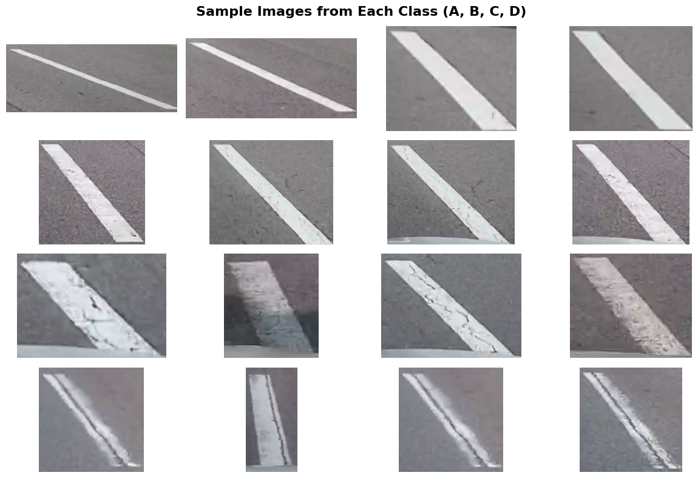
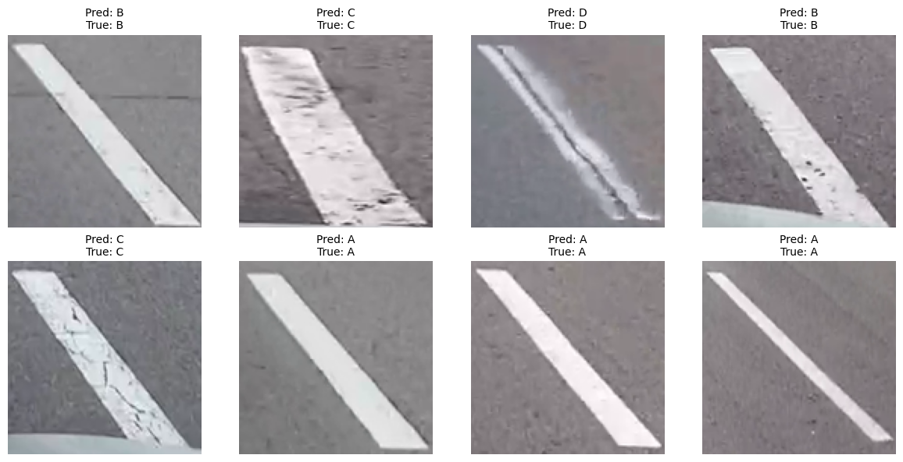
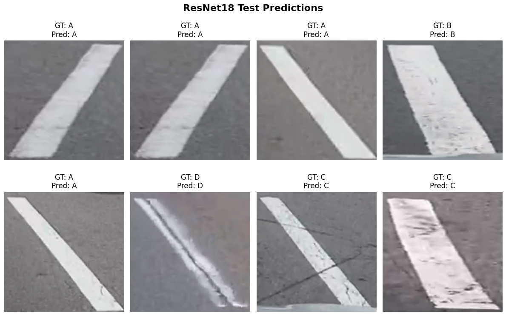
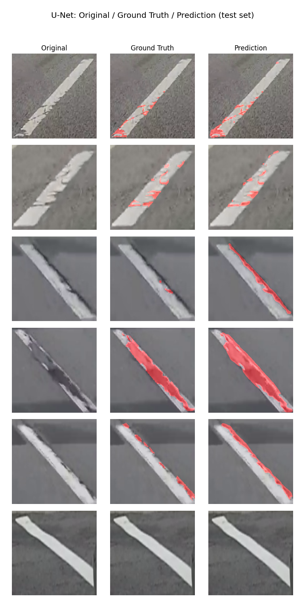

# 차선 훼손 분류 및 세그멘테이션

차선 이미지를 훼손 등급으로 분류하는 방법과 훼손 영역을 픽셀 단위로 분할하는 방법을 실험했습니다.

- 2024.03–2024.07: CNN과 ResNet18을 이용한 차선 훼손 등급 분류 (개인 진행)
- 2024.03–2024.07: 픽셀 단위 훼손 영역 라벨링(LabelMe) 진행
- 2026.09: 기존 라벨 데이터를 활용한 U-Net 훼손 영역 분할 추가 실험 (개인 진행)

---

## 프로젝트 개요

차선 훼손 상태를 카메라 이미지로 판별하기 위해 분류와 세그멘테이션을 각각 적용했습니다. 분류 모델은 이미지 전체의 훼손 등급을 예측하고, 세그멘테이션 모델은 훼손이 나타난 위치를 마스크로 출력합니다.

1. **분류(Classification)**: 차선 이미지를 훼손 등급(A~D)으로 분류 (CNN Baseline → ResNet18)
2. **세그멘테이션(Segmentation)**: 같은 계열의 데이터에 픽셀 단위 훼손 라벨을 추가로 확보해, 이미지 어디가 훼손됐는지 마스크로 예측 (U-Net)

분류 실험 이후 훼손 위치와 면적을 확인할 수 있도록 세그멘테이션 실험을 추가했습니다.

---

## 2024년 실험: 이미지 단위 훼손 등급 분류

### 데이터셋

| 클래스 | 설명 | 이미지 수 |
|--------|----------------------|---------|
| A | 정상 차선 (No damage) | 220 |
| B | 경미한 훼손 (Minor damage) | 102 |
| C | 중간 훼손 (Moderate damage) | 94 |
| D | 심각 훼손 (Severe damage) | 13 |

전체 데이터는 **429장**이며, D 클래스가 13장으로 클래스별 이미지 수의 차이가 큽니다.



### 전처리 및 데이터 증강
- 두 모델 모두 128×128 입력과 정규화(평균 0.5, 표준편차 0.5)를 사용
- ResNet18 학습 데이터에 Random Horizontal Flip / Random Rotation(±10°) / Color Jitter 적용
- D 클래스는 이미지 수가 적어 증강을 적용해도 데이터 불균형이 남았습니다.

### 모델 및 결과

| 모델 | 구조 | Test Accuracy |
|---|---|---:|
| CNN Baseline | Conv→ReLU→Pooling 3단 + Dropout | 93.48% |
| ResNet18 | ImageNet 사전학습 가중치 기반 미세조정 | 95.65% |

| CNN 예측 결과 | ResNet18 예측 결과 |
|---|---|
|  |  |

---

## 2026년 추가 실험: 픽셀 단위 훼손 영역 분할

등급 분류 결과만으로는 훼손 위치를 확인할 수 없습니다. LabelMe로 차선 영역과 개별 훼손 부위를 폴리곤으로 라벨링하여 이진 마스크로 변환해 U-Net을 학습했습니다.

### 데이터셋

| 클래스 | 설명 | 이미지 수 | 훼손 폴리곤 수 |
|---|---|---:|---:|
| A | 정상 (훼손 라벨 없음) | 250 | 0 |
| C | 중간 훼손 | 84 | - |
| F | 심각 훼손 | 42 | - |

총 **376장**, 훼손 인스턴스 폴리곤 **740개**(C+F 이미지에만 존재). A클래스는 전부 배경뿐인 마스크로, 모델이 "훼손 없음"을 정확히 배우는 데 사용됩니다.

클래스별 8:1:1로 층화 분할했습니다.

| Split | 전체 | A | C | F |
|---|---:|---:|---:|---:|
| Train | 302 | 200 | 68 | 34 |
| Val | 37 | 25 | 8 | 4 |
| Test | 37 | 25 | 8 | 4 |

### 모델: U-Net (4-level, from scratch)

256×256 입력, 인코더-디코더 각 4단, 채널 32→64→128→256→512(bottleneck). 훼손 클래스가 이미지 내 소수 픽셀이라 `CrossEntropyLoss(weight=[1.0, 5.0])`로 훼손 클래스에 가중치를 줬습니다. Random Flip/Rotation/ColorJitter 증강, Adam + Cosine 스케줄, 60 epoch.

### 결과 (test set, n=37, 픽셀 단위)

| Precision | Recall | F1-Score | IoU |
|---:|---:|---:|---:|
| 0.560 | 0.912 | 0.694 | 0.531 |

Recall이 Precision보다 높게 측정됐습니다. 훼손 클래스에 5.0의 가중치를 적용해 미탐을 줄이도록 학습했지만, 그에 따라 과탐이 증가한 것으로 보입니다. 학습 데이터가 302장이고 사전학습 모델을 사용하지 않았다는 한계가 있습니다.

### Original / Ground Truth / Prediction 비교



일부 훼손 영역은 정답 마스크와 비슷하게 예측했지만, 세 번째 행처럼 실제보다 넓은 영역을 훼손으로 분류한 사례도 있습니다. 이는 Precision 0.560과 관련된 과탐 사례입니다. 마지막 행의 정상 차선에서는 훼손 영역을 예측하지 않았습니다.

---

## 활용 가능성

예측 마스크에서 훼손 픽셀의 비율을 계산하면 점검할 도로 구간을 먼저 고르는 데 사용할 수 있습니다. 현재 실험은 제한된 이미지로 진행했으며, 실제 도로에서 사용하려면 촬영 환경이 달라졌을 때의 성능과 오탐률을 추가로 확인해야 합니다.

---

## 두 실험의 차이

등급 분류는 이미지마다 라벨 하나만 필요하지만 훼손 위치는 알 수 없습니다. 세그멘테이션은 폴리곤 라벨을 만드는 시간이 더 들지만 훼손의 위치와 면적을 계산할 수 있습니다. 분류 데이터는 A/B/C/D, 세그멘테이션 데이터는 A/C/F 체계이며 이미지 집합도 서로 다릅니다.

---

## 코드 구성

```text
.
├── train_cnn_baseline.py         # Part 1: CNN Baseline 학습
├── train_resnet18.py             # Part 1: ResNet18 학습
├── models/unet.py                # Part 2: U-Net 아키텍처
├── train_lane_unet.py            # Part 2: U-Net 학습 + 평가
├── build_lane_seg_dataset.py     # LabelMe JSON → 학습용 image/mask 변환 및 분할
├── build_gt_comparison.py        # Original/GT/Prediction 비교 이미지 생성
├── lane_unet.pth                 # 학습된 U-Net 체크포인트
└── Line Damage_calssfiation.ipynb  # Part 1 원본 노트북(정리 전)
```

## 실행 방법

원본 이미지 데이터는 포함하지 않았습니다. 아래는 재현을 위한 최소 절차입니다.

학습 데이터가 공개되어 있지 않으므로 저장소만으로 동일한 결과를 완전히 재현할 수는 없습니다. 공개된 코드는 데이터 구성과 학습·평가 절차를 확인하기 위한 용도입니다.

```bash
pip install -r requirements.txt

# Part 2: LabelMe 라벨(raw_labels/{A,C,F}/*.png, *.json)로부터 데이터셋 구성
python build_lane_seg_dataset.py

# U-Net 학습 및 평가
python train_lane_unet.py

# Original/GT/Prediction 비교 이미지 생성
python build_gt_comparison.py
```

---

## 확인한 한계와 다음 실험

분류 데이터에서 D 클래스는 13장뿐이어서 클래스별 성능을 충분히 확인하기 어렵습니다. 세그멘테이션도 학습 이미지가 302장이고 사전학습 모델을 사용하지 않았습니다.

다음에는 같은 이미지에 등급 라벨과 영역 라벨을 함께 구성하고, 사전학습 인코더를 사용한 U-Net과 현재 모델을 비교할 계획입니다. 비·야간 등 촬영 조건이 다른 도로 이미지도 추가로 필요합니다.
